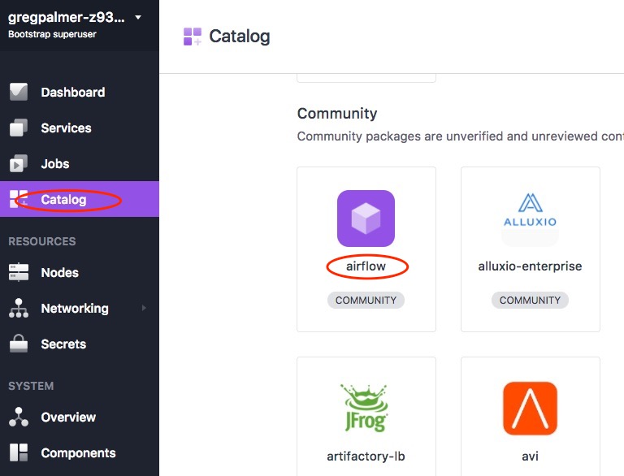
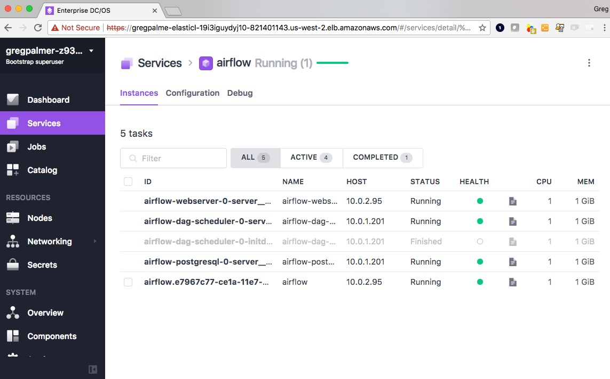

# airflow-dcos-package
Apache Airflow 1.8.0 running on Mesosphere's Data Center Operating System (DC/OS) version 1.10.

This project contains a DC/OS Service created using Mesosphere's Service SDK (see https://mesosphere.github.io/dcos-commons) that deploys the Apache Airflow DAG scheduler on a DC/OS Mesos cluster. It utilizes a Docker container image that includes the Airflow application components as well as the Mesos native libaries and Python Eggs for Mesos. Therefore, you do NOT have to preinstall Apache Airflow on each DC/OS agent node. Also, the Airflow MesosExecutor class has been modified to use a Docker container image to host the DAG tasks. It is recommended that you modify the default Docker image and add your DAG tasks' artifacts to the image and then specify that new image as the image to use when launching your DAG tasks (see the description of USE_DOCKER_CONTAINER and DEFAULT_DOCKER_CONTAINER_IMAGE below).

Contents:

     dcos-commons                          - The Mesosphere Service SDK project for building the Airflow Package
     eldge-lb                                  - The Edge-LB load balancer setup file (Enterprise DC/OS only)
     jobs/airflow-resetdb-job.json			-  DC/OS Job to run the Airflow "resetdb" process
     jobs/airflow-submit-tutorial-dag-job.json	- DC/OS Job to run an example DAG job
     reproxy/airflow-reproxy-marathon.json - DC/OS Marathon JSON to run the Reproxy load balancer

``USAGE``

### 1. Clone this repo on your client computer

     $ git clone https://github.com/gregpalmr/airflow-dcos-package

     $ cd airflow-dcos-package

### 2. Launch a DC/OS cluster with at least 3 private agent nodes and 1 public agent node.

To launch an appropriate sized DC/OS cluster, please refere to the following documentation:

     DC/OS System Requirements:
          https://docs.mesosphere.com/1.10/installing/custom/system-requirements

     DC/OS Installation:
           https://docs.mesosphere.com/1.10/installing

### 3. Build the Airflow DC/OS Package using the Mesosphere SDK.

Mesosphere's DC/OS SDK is a collection of tools, libraries, and documentation for easy integration and automation of stateful services, such as databases, message brokers, and caching services. The SDK is used to build a turn-key package that installs all of the tasks needed to support the Apache Airflow DAG Scheduler running on DC/OS. 

You can find details on the DC/OS SDK at these locations:

    Main Github:
        https://github.com/mesosphere/dcos-commons

    SDK Quick Start Guide:
         https://github.com/mesosphere/dcos-commons/blob/master/README.md#quick-start

    SDK Developer Guide:
         https://mesosphere.github.io/dcos-commons/developer-guide.html

The SDK automates the launching of the following tasks in the correct order and on the appropriate agent nodes:

    - Airflow PostgreSQL Database Instance
    - Airflow DAG Scheduler InitDB process
    - Airflow DAG Scheduler Server
    - Airflow Webserver, Web console

This implementation of the Airflow package using the DC/OS SDK is implemented with YAML and JSON files with a small Java program used for automated testing. While this specification is far from complete, it provides a good example of how to use the DC/OS SDK to build a single-click installable package. The source files that were customized are listed here:

     - src/main/dist/svc.yml - The SDK specification for the tasks to be started as part of the Airflow service
     - universe/marathon.json.mustache - The SDK specification for the JSON template for use with Marathon
     - universe/config.json - The SDK specification for the configuration variables to be prompted for when launcing the Airflow service
     - src/test/java/com/mesosphere/sdk/airflow/scheduler/ServiceTest.java - The SDK test class for use when building the package

To build the Airflow package using the SDK, follow these instructions:

Change directory to the Airflow framework source code directory.

     $ cd dcos-commons/frameworks/airflow

Set two environment variables that point to your Amazon S3 bucket to place the resulting package files. There is also a "web" option to build the package to be hosted by an HTTP server somewhere on your network.

     $ export S3_DIR_PATH=dcos_catalog && export S3_BUCKET=YOUR-S3-BUCKET 

Invoke the builder using the build.sh script with the "aws" option.

     $ ./build.sh aws

When the build process is complete, you will see a message like this:

    (Re)install your package using the following commands:
    dcos package uninstall airflow

    dcos package repo remove airflow-aws
    dcos package repo add --index=0 airflow-aws https://universe-converter.mesosphere.com/transform?url=https://YOUR-S3-BUCKET.s3.amazonaws.com/dcos_catalog/airflow/HASH-VALUE/stub-universe-airflow.json
    dcos package install --yes airflow

### 4. Install the newly built DC/OS package repo and launch the Airflow package.

    Uninstall any previous Airflow package repo (Catalog)
    $ dcos package repo remove airflow-aws

    Install the newly built Airflow package repo (Catalog)
    $ dcos package repo add --index=0 airflow-aws https://universe-converter.mesosphere.com/transform?url=https://YOUR-S3-BUCKET.s3.amazonaws.com/dcos_catalog/airflow/HASH-VALUE/stub-universe-airflow.json

    Install the Airflow Catalog
    $ dcos package install --yes airflow

    Or use the DC/OS Dashboard's Catalog panel to install the Airflow service:

    

    Wait a few minutes and you will see the various Airflow tasks startup. If you use the DC/OS Dashboard's Service panel to view the airflow application group, you will see the tasks startup. Click on the ALL option to see the tasks that have completed too.

    

### 5. Install an external load balancer to access the Airflow Web console.

The package is designed to run the Airflow tasks on the private agent nodes which normally are not accessable by users and applications from outside of the DC/OS cluster. In order to access the Apache Airflow Web console, you will need run run an extnerally facing load balancer running on your public agent node. 

For Enterprise DC/OS

If you are using the Enterprise version of DC/OS, install the Edge-LB load balancer on your DC/OS cluster. See these instructions:

     https://docs.mesosphere.com/1.10/networking/edge-lb

     Once the Edge-LB load balancer is running, configure a pool to serve the Airflow Webserver 

     $ dcos edgelb config edge-lb/airflow-edge-lb.yaml

     Then check the Edge-LB HAPROXY console to see the status of thefrontends and backends.

     URL: http:<public agent node ip address>:9090/haproxy?stats

For Open Source DC/OS or Enterprise DC/OS

If you are using the Open Source version of DC/OS, you should install the Repoxy proxy server on your public agent node. See these instructions:

     https://gist.github.com/nlsun/877411115f7e3b885b5e9daa8821722f

For using Reproxy with this DC/OS Airflow package, use these instructions:

     Find out what HTTP port the Airflow Webserver process is using
     $ http_port=$(dcos task log airflow-webserver-0 stdout --lines=200 | grep Host: | cut -d ':' -f 3) \
       && echo $http_port

     Modify the reproxy Marathon json to proxy that port
     $ sed "s/1025/${http_port}/" reproxy/airflow-reproxy-marathon.json > /tmp/airflow-reproxy-marathon.json

     Use the DC/OS command line interface or CLI to start Reproxy using Marthon.
     $ dcos marathon app add /tmp/airflow-reproxy-marathon.json

     $ dcos task log airflow-reproxy | grep 'Airflow Webserver'

     The results of the "dcos task log" command will display the entry in the Reproxy STDOUT that shows
     the URL to use to access the proxied Airflow Webserver port. Something like this:

          Airflow Webserver: 34.208.88.58:23338/airflow

### 6. Launch an example DAG job.

Use the DC/OS Job scheduler to run an example Airflow job. 

    $ dcos job add jobs/airflow-submit-tutorial-dag-job.json

    $ dcos job run airflow-submit-tutorial-dag-job

Once the example DAG job is running, you can view the progress on the Airflow Web console by clicking on the "tutorial" DAG listed on the "DAGs" page.

### 7. Reset the Airflow database.

You can optionally reset the Airflow Postgres database schema (erasing all previous data) by running this DC/OS job:

     $ dcos job add jobs/airflow-resetdb-job.json

     $ dcos job run airflow-resetdb-job

